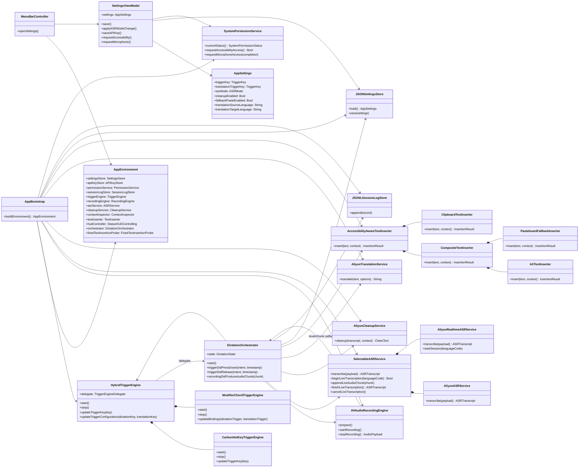

# voiceKey 类图

最后更新：2026-04-22

这份文档只描述当前仓库主线实现，不描述已经删除的旧触发器实验代码。

当前主线：

- `Fn` 听写
- `Fn + Control` 翻译
- `Fn + Shift` 备选
- `Offline` 默认，`Realtime` 可切换
- 有辅助功能权限时优先直写，无权限时回退到剪贴板

## 核心类图

## 读图要点

- `AppBootstrap` 是唯一的装配入口，所有运行时依赖都在这里接起来。
- `HybridTriggerEngine` 统一管理两条触发路径：
  一条是 `CarbonHotKeyTriggerEngine`，用于 `⌘ + ;` 这类 Carbon 可注册热键。
  另一条是 `ModifierChordTriggerEngine`，用于 `Fn`、`Fn + Control`、`Fn + Shift`。
- `DictationOrchestrator` 是主流程核心。它不关心具体热键实现，只消费 `press/release` 语义，并驱动录音、识别、翻译、清理、写入和日志。
- `SelectableASRService` 把 `offline` 和 `realtime` 两条识别链路收口到一个接口里，并负责在单次转写失败时回退到 `offline`。
- `AccessibilityAwareTextInserter` 只做一个判断：
  有辅助功能权限时走 `AX + paste fallback`，没有时直接落到剪贴板。
