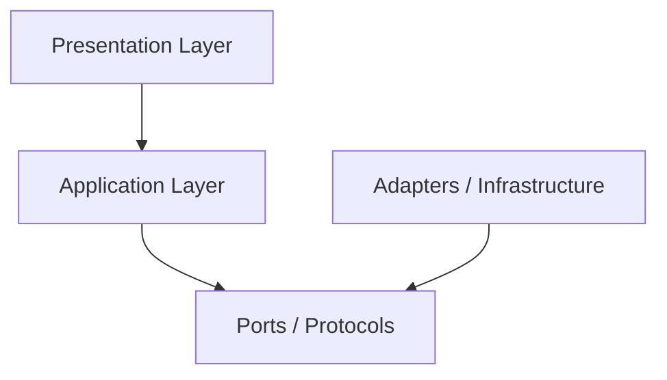
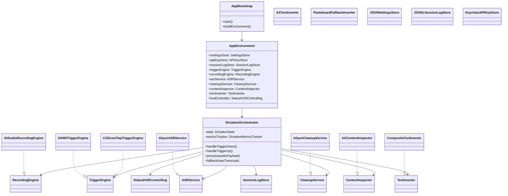

# voiceKey V1 代码架构蓝图

最后更新：2026-04-11

## 1. 目标

这份文档只回答一个问题：

`代码应该怎么组织，才能在保持实现足够轻的同时，优先保证 竞品 级手感。`

结论：

- 不做重型 Clean Architecture
- 做一个 `light ports-and-adapters`
- 核心用例只有一条：`Trigger -> Record -> ASR -> Clean-up -> Insert`

## 2. 设计原则

### 2.1 丝滑优先

任何会影响手感的层，都允许变重一点。

### 2.2 主路径优先

只围绕一条黄金路径设计对象，不为未来功能提前建太多抽象。

### 2.3 边界清楚

虽然不做重架构，但必须保证：

- 触发层可替换
- ASR 可替换
- clean-up 可替换
- insertion 可替换

### 2.4 平台能力与业务逻辑分离

`AVAudioEngine`、`AXUIElement`、`CGEventTap` 这些都属于平台适配层。

协调状态机和业务流程的，不应该直接依赖它们的细节。

## 3. 分层设计

推荐 4 层。



### 3.1 Presentation Layer

职责：

- menubar
- settings
- HUD
- 权限提示

这层不做业务判断。

### 3.2 Application Layer

职责：

- 驱动状态机
- 串联录音、ASR、clean-up、插入
- 处理失败回退

这层是 v1 的核心。

### 3.3 Ports / Protocols

职责：

- 抽象外部依赖
- 让应用层不直接绑定具体实现

### 3.4 Adapters / Infrastructure

职责：

- 对接 macOS 系统能力
- 对接阿里云 API
- 对接本地文件与 Keychain

## 4. 目录结构

建议目录如下：

```text
voiceKey/
├── VoiceKey.xcodeproj
├── voiceKey/
│   ├── App/
│   │   ├── VoiceKeyApp.swift
│   │   ├── AppDelegate.swift
│   │   ├── AppBootstrap.swift
│   │   ├── AppEnvironment.swift
│   │   └── BuildInfo.swift
│   ├── Presentation/
│   │   ├── MenuBar/
│   │   │   ├── MenuBarController.swift
│   │   │   └── MenuContentBuilder.swift
│   │   ├── HUD/
│   │   │   ├── StatusHUD.swift
│   │   │   ├── HUDState.swift
│   │   │   └── AppKitStatusHUDController.swift
│   │   ├── Settings/
│   │   │   ├── SettingsView.swift
│   │   │   ├── SettingsViewModel.swift
│   │   │   └── SettingsWindowController.swift
│   │   └── Permissions/
│   │       └── PermissionPromptPresenter.swift
│   ├── Application/
│   │   ├── Dictation/
│   │   │   ├── DictationOrchestrator.swift
│   │   │   ├── DictationState.swift
│   │   │   ├── DictationSessionContext.swift
│   │   │   ├── DictationMetricsTracker.swift
│   │   │   └── TriggerEvent.swift
│   │   └── Settings/
│   │       └── SettingsCoordinator.swift
│   ├── Domain/
│   │   ├── Models/
│   │   │   ├── AppSettings.swift
│   │   │   ├── AudioPayload.swift
│   │   │   ├── ASRTranscript.swift
│   │   │   ├── CleanText.swift
│   │   │   ├── FocusedContext.swift
│   │   │   ├── InsertionResult.swift
│   │   │   ├── SessionRecord.swift
│   │   │   └── LatencyMetrics.swift
│   │   └── Ports/
│   │       ├── TriggerEngine.swift
│   │       ├── RecordingEngine.swift
│   │       ├── ASRService.swift
│   │       ├── CleanupService.swift
│   │       ├── ContextInspector.swift
│   │       ├── TextInserter.swift
│   │       ├── StatusHUDControlling.swift
│   │       ├── SettingsStore.swift
│   │       ├── SessionLogStore.swift
│   │       ├── APIKeyStore.swift
│   │       ├── Clock.swift
│   │       └── HTTPClient.swift
│   ├── Infrastructure/
│   │   ├── Trigger/
│   │   │   ├── CGEventTapTriggerEngine.swift
│   │   │   ├── IOHIDTriggerEngine.swift
│   │   │   └── TriggerKeyMapper.swift
│   │   ├── Audio/
│   │   │   ├── AVAudioRecordingEngine.swift
│   │   │   ├── AudioSessionPrewarmer.swift
│   │   │   └── TemporaryAudioFileWriter.swift
│   │   ├── Aliyun/
│   │   │   ├── HTTP/
│   │   │   │   ├── URLSessionHTTPClient.swift
│   │   │   │   └── AliyunRequestSigner.swift
│   │   │   ├── ASR/
│   │   │   │   ├── AliyunASRService.swift
│   │   │   │   ├── AliyunASRRequest.swift
│   │   │   │   └── AliyunASRResponse.swift
│   │   │   └── Cleanup/
│   │   │       ├── AliyunCleanupService.swift
│   │   │       ├── CleanupPromptBuilder.swift
│   │   │       └── AliyunCleanupResponse.swift
│   │   ├── Context/
│   │   │   ├── AXContextInspector.swift
│   │   │   └── FrontmostAppResolver.swift
│   │   ├── Insertion/
│   │   │   ├── AXTextInserter.swift
│   │   │   ├── PasteboardFallbackInserter.swift
│   │   │   ├── SyntheticPasteExecutor.swift
│   │   │   └── CompositeTextInserter.swift
│   │   ├── Storage/
│   │   │   ├── JSONSettingsStore.swift
│   │   │   ├── JSONLSessionLogStore.swift
│   │   │   └── FileSystemPaths.swift
│   │   ├── Security/
│   │   │   └── KeychainAPIKeyStore.swift
│   │   └── Support/
│   │       ├── SystemClock.swift
│   │       ├── OSLogLogger.swift
│   │       └── ErrorMapper.swift
│   ├── Resources/
│   │   ├── Assets.xcassets
│   │   ├── Defaults/
│   │   │   └── settings.default.json
│   │   └── PrivacyInfo.xcprivacy
│   └── Support/
│       ├── Constants.swift
│       └── Extensions/
├── voiceKeyTests/
│   ├── Application/
│   │   └── DictationOrchestratorTests.swift
│   ├── Infrastructure/
│   │   ├── CleanupPromptBuilderTests.swift
│   │   ├── JSONSettingsStoreTests.swift
│   │   └── CompositeTextInserterTests.swift
│   └── TestDoubles/
│       ├── FakeTriggerEngine.swift
│       ├── FakeRecordingEngine.swift
│       ├── FakeASRService.swift
│       ├── FakeCleanupService.swift
│       ├── FakeTextInserter.swift
│       └── SpyHUDController.swift
└── docs/
```

## 5. 目录为什么这么分

### 5.1 `App/`

放应用入口和依赖装配。

这一层只负责：

- 启动
- 依赖注入
- 搭建对象图

### 5.2 `Presentation/`

放所有和用户界面直接相关的对象。

这层不直接调用阿里云，不直接写 AX，不直接控制音频。

### 5.3 `Application/`

放核心用例。

v1 最重要的只有一个对象：

- `DictationOrchestrator`

### 5.4 `Domain/`

放协议和基础模型。

这是整个工程里最稳定的层。

### 5.5 `Infrastructure/`

放所有具体实现。

后续如果你要：

- `Right Option -> Fn`
- `qwen3-asr-flash -> qwen3-asr-flash-realtime`
- `CGEventTap -> IOHIDManager`

主要改的都在这里。

## 6. 依赖规则

只允许这样依赖：

```text
Presentation -> Application -> Domain.Ports
Infrastructure -> Domain.Ports
Application -> Domain.Models
Presentation -> Domain.Models
```

不允许：

- `Presentation` 直接依赖阿里云实现
- `Application` 直接依赖 `AVAudioEngine`
- `Application` 直接依赖 `AXUIElement`

## 7. 核心协议设计

### 7.1 Trigger

```swift
protocol TriggerEngine: AnyObject {
    var delegate: TriggerEngineDelegate? { get set }
    func start() throws
    func stop()
    func updateTriggerKey(_ key: TriggerKey) throws
}

protocol TriggerEngineDelegate: AnyObject {
    func triggerDidPressDown(at timestamp: TimeInterval)
    func triggerDidRelease(at timestamp: TimeInterval)
}

enum TriggerKey: String, Codable {
    case rightOption
    case fn
}
```

### 7.2 Recording

```swift
protocol RecordingEngine {
    func prepare() async throws
    func startRecording() throws
    func stopRecording() async throws -> AudioPayload
}
```

### 7.3 ASR

```swift
protocol ASRService {
    func transcribe(_ payload: AudioPayload) async throws -> ASRTranscript
}
```

### 7.4 Clean-up

```swift
protocol CleanupService {
    func cleanup(
        transcript: ASRTranscript,
        context: CleanupContext
    ) async throws -> CleanText
}
```

### 7.5 Context

```swift
protocol ContextInspector {
    func currentContext() throws -> FocusedContext
}
```

### 7.6 Text Insertion

```swift
protocol TextInserter {
    func insert(
        _ text: String,
        into context: FocusedContext
    ) throws -> InsertionResult
}
```

### 7.7 HUD

```swift
protocol StatusHUDControlling: AnyObject {
    func showRecording()
    func showProcessing()
    func showSuccess()
    func showFailure(message: String)
    func dismiss()
}
```

### 7.8 Settings / Logging / Keychain

```swift
protocol SettingsStore {
    func load() throws -> AppSettings
    func save(_ settings: AppSettings) throws
}

protocol SessionLogStore {
    func append(_ record: SessionRecord) async
}

protocol APIKeyStore {
    func save(_ key: String) throws
    func load() throws -> String
}
```

### 7.9 Time / HTTP

```swift
protocol Clock {
    func now() -> Date
}

protocol HTTPClient {
    func perform(_ request: URLRequest) async throws -> (Data, HTTPURLResponse)
}
```

## 8. 核心模型设计

### 8.1 `AppSettings`

```swift
struct AppSettings: Codable {
    var triggerKey: TriggerKey
    var microphoneDeviceID: String
    var cleanupEnabled: Bool
    var showHUD: Bool
    var fallbackPasteEnabled: Bool
}
```

### 8.2 `AudioPayload`

```swift
struct AudioPayload {
    let fileURL: URL
    let format: String
    let sampleRate: Int
    let durationMs: Int
}
```

### 8.3 `ASRTranscript`

```swift
struct ASRTranscript {
    let rawText: String
    let languageCode: String?
}
```

### 8.4 `CleanText`

```swift
struct CleanText {
    let value: String
}
```

### 8.5 `FocusedContext`

```swift
struct FocusedContext {
    let bundleIdentifier: String
    let applicationName: String
    let windowTitle: String?
    let elementRole: String?
    let isEditable: Bool
}
```

### 8.6 `InsertionResult`

```swift
struct InsertionResult {
    let success: Bool
    let usedFallback: Bool
    let failureReason: String?
}
```

### 8.7 `LatencyMetrics`

```swift
struct LatencyMetrics: Codable {
    var recordingDurationMs: Int
    var asrDurationMs: Int
    var cleanupDurationMs: Int
    var insertionDurationMs: Int
    var totalAfterReleaseMs: Int
}
```

### 8.8 `SessionRecord`

```swift
struct SessionRecord: Codable {
    let id: UUID
    let startedAt: Date
    let endedAt: Date
    let focusedApp: String
    let rawTranscript: String?
    let cleanText: String?
    let inserted: Bool
    let fallbackUsed: Bool
    let failureReason: String?
    let latency: LatencyMetrics
}
```

## 9. 核心类设计

### 9.1 `AppBootstrap`

职责：

- 创建所有依赖
- 装配对象图
- 启动 menubar 和 trigger

依赖：

- `SettingsStore`
- `APIKeyStore`
- `HTTPClient`

### 9.2 `AppEnvironment`

职责：

- 保存已经装配好的长期依赖
- 给 UI 和 orchestrator 提供统一入口

说明：

这是轻量依赖容器，不做复杂 IOC。

### 9.3 `MenuBarController`

职责：

- 创建菜单栏图标
- 提供状态入口
- 打开设置页

### 9.4 `DictationOrchestrator`

职责：

- 接收 trigger 事件
- 驱动录音、ASR、clean-up、插入
- 记录 metrics
- 控制回退

这是最重要的类。

它应该是唯一同时知道：

- 当前状态
- 当前上下文
- 当前音频结果
- 当前回退策略

### 9.5 `DictationMetricsTracker`

职责：

- 记录每个阶段开始结束时间
- 输出 `LatencyMetrics`

不要把时间统计逻辑散落在 orchestrator 里。

### 9.6 `CGEventTapTriggerEngine`

职责：

- 监听 `Right Option` 或未来的 `Fn`
- 转成统一 trigger 事件

### 9.7 `IOHIDTriggerEngine`

职责：

- 作为更低层的替代实现

只在 `CGEventTap` 不稳时启用。

### 9.8 `AVAudioRecordingEngine`

职责：

- 预热录音链
- 开始录音
- 停止录音
- 交给 `TemporaryAudioFileWriter`

### 9.9 `AliyunASRService`

职责：

- 调用 `qwen3-asr-flash`
- 解析 transcript

不要在这里做 clean-up。

### 9.10 `CleanupPromptBuilder`

职责：

- 生成极度保守的 clean-up prompt

这应该单独拆出来，便于测试和调 prompt。

### 9.11 `AliyunCleanupService`

职责：

- 调用 `qwen3.5-flash`
- 丢弃 reasoning 相关字段
- 返回最终文本

### 9.12 `AXContextInspector`

职责：

- 获取 frontmost app
- 获取 focused element
- 判断是否可编辑

### 9.13 `AXTextInserter`

职责：

- 通过 AX 主路径写入文本

### 9.14 `PasteboardFallbackInserter`

职责：

- 保存原剪贴板
- 写入目标文本
- 触发粘贴
- 恢复用户原剪贴板

### 9.15 `CompositeTextInserter`

职责：

- 先试 `AXTextInserter`
- 失败后再试 `PasteboardFallbackInserter`

这比把回退逻辑写在 orchestrator 里更干净。

### 9.16 `JSONSettingsStore`

职责：

- 读写 `settings.json`

### 9.17 `JSONLSessionLogStore`

职责：

- 追加写 `sessions.jsonl`

### 9.18 `KeychainAPIKeyStore`

职责：

- 读写阿里云 key

## 10. 类图



## 11. 建议的启动顺序

### 第 1 批先建

- `AppBootstrap`
- `AppEnvironment`
- `TriggerEngine` 协议
- `CGEventTapTriggerEngine`
- `RecordingEngine` 协议
- `AVAudioRecordingEngine`
- `ContextInspector` 协议
- `AXContextInspector`
- `TextInserter` 协议
- `AXTextInserter`
- `PasteboardFallbackInserter`
- `CompositeTextInserter`
- `DictationOrchestrator`

### 第 2 批再建

- `HTTPClient`
- `AliyunASRService`
- `AliyunCleanupService`
- `CleanupPromptBuilder`
- `KeychainAPIKeyStore`
- `JSONSettingsStore`
- `JSONLSessionLogStore`

### 第 3 批最后建

- `MenuBarController`
- `AppKitStatusHUDController`
- `SettingsViewModel`

## 12. 升级留口

这套结构已经给后续升级留好了口。

### 12.1 `Right Option -> Fn`

只改：

- `TriggerKey`
- `TriggerEngine` 实现与配置

### 12.2 `qwen3-asr-flash -> qwen3-asr-flash-realtime`

主要改：

- `ASRService` 实现

应用层不动。

### 12.3 通用插入 -> app 特化

只改：

- `CompositeTextInserter`
- 新增 app-specific inserter

## 13. 结论

最合理的代码组织方式不是“写一堆层”，而是：

- 一条核心 orchestrator
- 一组清晰的 ports
- 一批可替换的系统与云端 adapters

一句话：

`v1 要做的是可替换的输入工具，不是可扩展的平台。`
