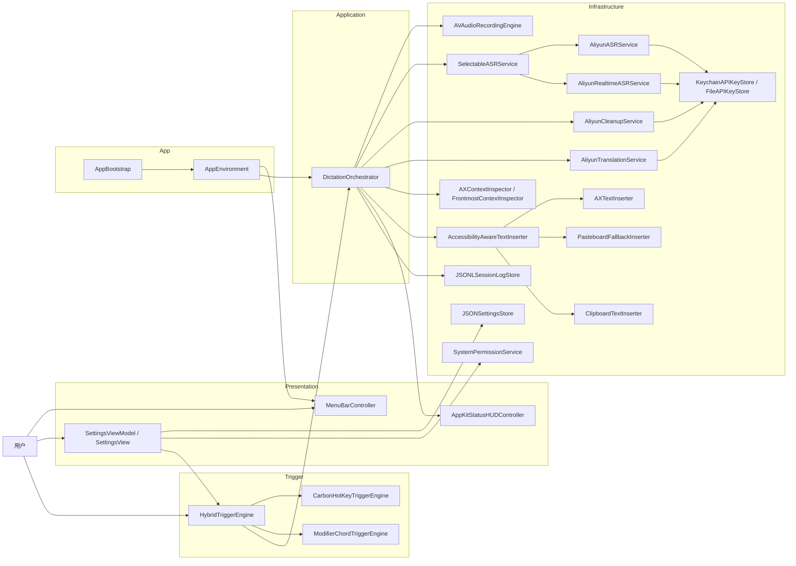
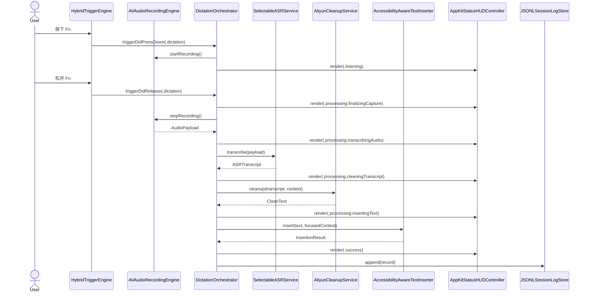
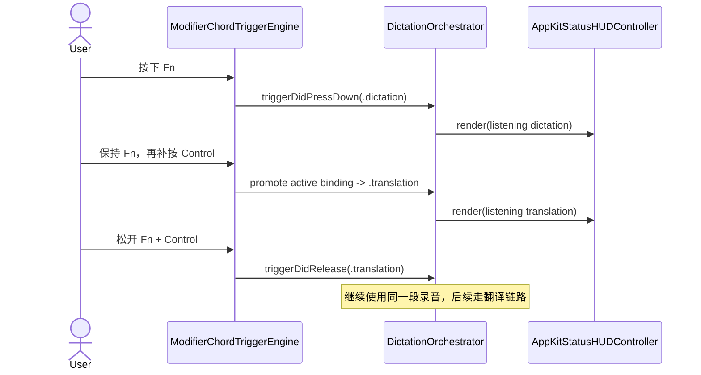
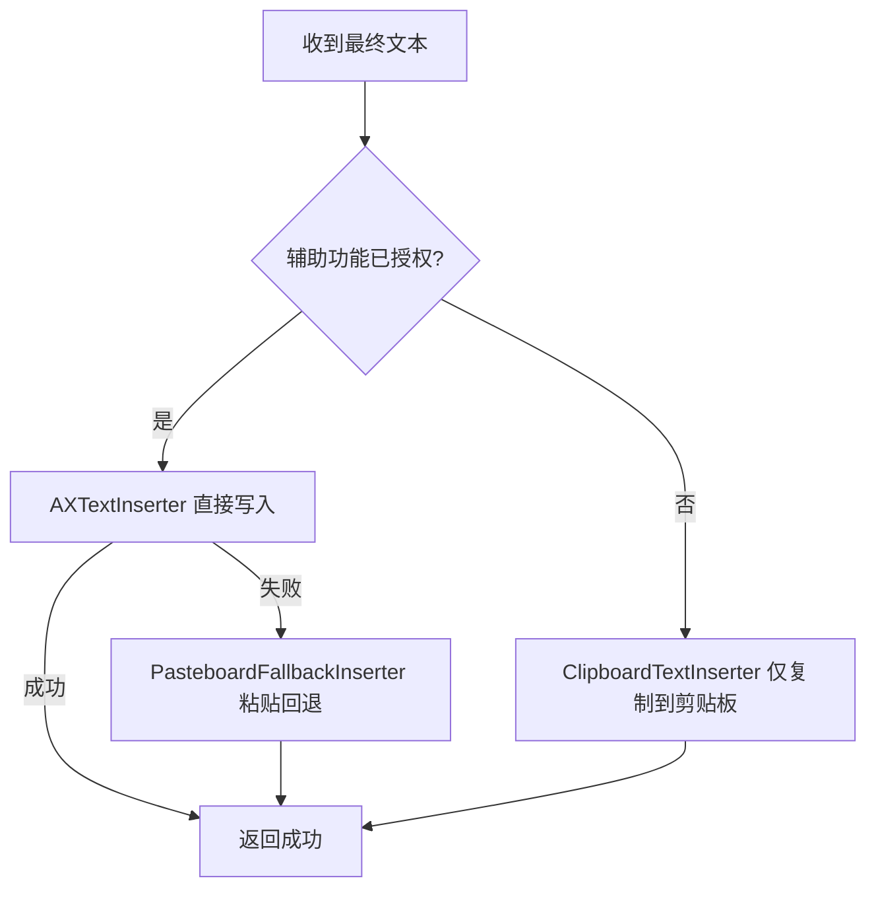

# voiceKey 内部详细设计

最后更新：2026-04-22

这份文档描述当前仓库真实运行链路，对应 `1.0.2` 这版代码，而不是早期 `Right Option` 原型。

## 1. 当前设计结论

当前主路径是：

`按住 Fn 说话 -> 松开 -> 识别 -> 轻整理 -> 写回当前输入位置`

翻译路径是：

`按住 Fn + Control 说话 -> 松开 -> 识别 -> 翻译 -> 写回当前输入位置`

几个关键边界：

- 默认 ASR 模式是 `offline`
- 设置里可以切到 `realtime`
- `realtime` 单次失败时，会自动回退到 `offline`
- 有辅助功能权限时优先直写
- 没有辅助功能权限时，自动回退到剪贴板
- `Fn + Shift` 作为备选热键，避免听写和翻译使用同一组按键

## 2. 运行时组件图

## 3. 一次普通听写的时序

## 4. 听写升级成翻译的时序

这条链路是最近修过的重点。用户先按 `Fn` 开始说，如果中途补按 `Control`，不应该先释放一段短垃圾录音，再新开一段翻译录音。

当前做法是“升级 intent”，不是“结束再重开”。

## 5. 触发器设计

当前不是单一触发器，而是混合触发器。

### 5.1 为什么有 `HybridTriggerEngine`

因为两类热键在 macOS 上适合的机制不同：

- `⌘ + ;` 这一类标准组合键，适合用 Carbon 全局热键
- `Fn`、`Fn + Control`、`Fn + Shift` 这一类 modifier chord，不适合走 Carbon，需要监听 `flagsChanged`

所以 `HybridTriggerEngine` 做的事不是“再包一层”，而是把两种系统能力收成同一个 `TriggerEngine` 接口。

### 5.2 当前触发器选择表

| 触发键 | 当前机制 | 原因 |
| --- | --- | --- |
| `Fn` | `ModifierChordTriggerEngine` | `Fn` 不是 Carbon 兼容热键 |
| `Fn + Control` | `ModifierChordTriggerEngine` | 需要和 `Fn` 做同一组升级逻辑 |
| `Fn + Shift` | `ModifierChordTriggerEngine` | 作为 `Fn` 家族备选键 |
| `⌘ + ;` | `CarbonHotKeyTriggerEngine` | 标准组合键，注册稳定 |
| `⌃⌘ + ;` | `CarbonHotKeyTriggerEngine` | 同上 |

### 5.3 `Fn` 家族为什么要做歧义延迟

`Fn` 和 `Fn + Control`、`Fn + Shift` 共享同一颗基础键。

如果用户刚按下 `Fn`，系统立刻触发听写，就没有时间判断他是不是还想继续补一个 `Control` 变成翻译。  
所以 `ModifierChordTriggerEngine` 对有歧义的组合做了一个很短的判定窗口，避免：

- 听写误触发
- 翻译按不出来
- `Fn` 先触发一轮，再被 `Fn + Control` 打断

## 6. ASR 设计

### 6.1 为什么要有 `SelectableASRService`

设置里允许用户在 `offline` 和 `realtime` 之间切换，但 `DictationOrchestrator` 不应该直接知道“当前到底是哪条链路”。

所以 `SelectableASRService` 负责：

- 读取 `settings.json` 当前的 `asrMode`
- 决定走 `AliyunASRService` 还是 `AliyunRealtimeASRService`
- 在 `realtime` 单次失败时自动回退到 `offline`

### 6.2 当前策略

- `offline`
  一次性上传音频文件，默认更稳
- `realtime`
  允许 live session，便于调实时链路
- 但如果 `realtime` 失败，不把整次输入拖死，仍然给用户一个 `offline` 结果

## 7. 文本写入设计

### 7.1 当前写入策略

`TextInserter` 不是单实现，而是分层回退：

1. `AccessibilityAwareTextInserter`
2. `CompositeTextInserter`
3. `AXTextInserter`
4. `PasteboardFallbackInserter`
5. `ClipboardTextInserter`

### 7.2 决策规则

### 7.3 当前版本边界

- `Debug` 本地版支持辅助功能直写
- 未授权时，不再硬报错，而是自动回退到剪贴板
- `PasteboardFallbackInserter` 仍然是时序型 heuristic，需要真机 smoke 继续盯

## 8. 配置与持久化

### 8.1 当前持久化对象

- `settings.json`
  保存热键、ASR 模式、翻译语言、cleanup 开关等
- `sessions.jsonl`
  记录每次链路结果和耗时，便于排障
- Keychain / 本地回退文件
  保存百炼 API Key

### 8.2 设置页即时生效规则

- `ASR Mode`：切换时即时保存并即时应用
- 热键：保存设置后应用到运行中的 `HybridTriggerEngine`
- API Key：单独保存，不依赖底部“保存设置”

## 9. 当前最重要的设计约束

### 9.1 约束一，黄金路径优先

`DictationOrchestrator` 只围绕一条主流程设计：

- 触发
- 录音
- 转写 / 翻译
- 清理
- 写入
- 记录

没有把“未来所有语音能力”都塞进去。

### 9.2 约束二，平台能力不穿透应用层

应用层不应该直接知道：

- Carbon 热键怎么注册
- `flagsChanged` 怎么判断
- AX 怎么写
- 剪贴板怎么恢复

这些都留在 `Infrastructure`。

### 9.3 约束三，失败不能把整次输入拖死

这版代码里最重要的兜底就是：

- `realtime` 失败回退 `offline`
- AX 失败回退 paste
- 没权限回退 clipboard
- cleanup 失败时，普通听写还能尝试 raw transcript 回退

这几条是保证“能用”的底线。
