# tinyTypeless V1 Swift 骨架设计

最后更新：2026-04-11

## 1. 目标

这份文档回答的是：

`如果现在开始建 Xcode 工程，第一批 Swift 文件应该怎么落，类怎么连，接口怎么收。`

它是 [代码架构蓝图](/Users/littlerobot/working_code/tinyTypeless/docs/code-architecture-blueprint.md) 的下一层。

这里不再讨论“要不要这么做”，只讨论：

- 先创建哪些文件
- 每个文件里先放什么
- 对象之间怎么依赖
- 哪些类先写空骨架也合理

## 2. 实现策略

v1 先按两条线推进：

- `主链路骨架`
  - Trigger
  - Recording
  - ASR
  - Clean-up
  - Insert
- `宿主骨架`
  - Menubar
  - HUD
  - Settings
  - Permission prompt

真正先能跑起来的最小闭环只需要：

- `AppBootstrap`
- `AppEnvironment`
- `DictationOrchestrator`
- `CGEventTapTriggerEngine`
- `AVAudioRecordingEngine`
- `AXContextInspector`
- `CompositeTextInserter`
- `AliyunASRService`
- `AliyunCleanupService`
- `AppKitStatusHUDController`

## 3. 推荐文件树

```text
tinyTypeless/
├── tinyTypeless/
│   ├── App/
│   │   ├── TinyTypelessApp.swift
│   │   ├── AppDelegate.swift
│   │   ├── AppBootstrap.swift
│   │   ├── AppEnvironment.swift
│   │   └── BuildInfo.swift
│   ├── Presentation/
│   │   ├── MenuBar/
│   │   │   ├── MenuBarController.swift
│   │   │   └── MenuContentBuilder.swift
│   │   ├── HUD/
│   │   │   ├── HUDState.swift
│   │   │   ├── StatusHUD.swift
│   │   │   └── AppKitStatusHUDController.swift
│   │   ├── Settings/
│   │   │   ├── SettingsView.swift
│   │   │   ├── SettingsViewModel.swift
│   │   │   └── SettingsWindowController.swift
│   │   └── Permissions/
│   │       └── PermissionPromptPresenter.swift
│   ├── Application/
│   │   └── Dictation/
│   │       ├── DictationOrchestrator.swift
│   │       ├── DictationState.swift
│   │       ├── DictationSessionContext.swift
│   │       ├── DictationMetricsTracker.swift
│   │       ├── TriggerEvent.swift
│   │       ├── CleanupContext.swift
│   │       └── DictationError.swift
│   ├── Domain/
│   │   ├── Models/
│   │   │   ├── AppSettings.swift
│   │   │   ├── AudioPayload.swift
│   │   │   ├── ASRTranscript.swift
│   │   │   ├── CleanText.swift
│   │   │   ├── FocusedContext.swift
│   │   │   ├── InsertionResult.swift
│   │   │   ├── LatencyMetrics.swift
│   │   │   └── SessionRecord.swift
│   │   └── Ports/
│   │       ├── TriggerEngine.swift
│   │       ├── RecordingEngine.swift
│   │       ├── ASRService.swift
│   │       ├── CleanupService.swift
│   │       ├── ContextInspector.swift
│   │       ├── TextInserter.swift
│   │       ├── StatusHUDControlling.swift
│   │       ├── SettingsStore.swift
│   │       ├── SessionLogStore.swift
│   │       ├── APIKeyStore.swift
│   │       ├── Clock.swift
│   │       └── HTTPClient.swift
│   ├── Infrastructure/
│   │   ├── Trigger/
│   │   │   ├── CGEventTapTriggerEngine.swift
│   │   │   ├── IOHIDTriggerEngine.swift
│   │   │   └── TriggerKeyMapper.swift
│   │   ├── Audio/
│   │   │   ├── AVAudioRecordingEngine.swift
│   │   │   ├── AudioSessionPrewarmer.swift
│   │   │   └── TemporaryAudioFileWriter.swift
│   │   ├── Aliyun/
│   │   │   ├── HTTP/
│   │   │   │   ├── URLSessionHTTPClient.swift
│   │   │   │   └── AliyunRequestFactory.swift
│   │   │   ├── ASR/
│   │   │   │   ├── AliyunASRService.swift
│   │   │   │   ├── AliyunASRRequest.swift
│   │   │   │   └── AliyunASRResponse.swift
│   │   │   └── Cleanup/
│   │   │       ├── AliyunCleanupService.swift
│   │   │       ├── CleanupPromptBuilder.swift
│   │   │       └── AliyunCleanupResponse.swift
│   │   ├── Context/
│   │   │   ├── AXContextInspector.swift
│   │   │   └── FrontmostAppResolver.swift
│   │   ├── Insertion/
│   │   │   ├── AXTextInserter.swift
│   │   │   ├── PasteboardFallbackInserter.swift
│   │   │   ├── SyntheticPasteExecutor.swift
│   │   │   └── CompositeTextInserter.swift
│   │   ├── Storage/
│   │   │   ├── JSONSettingsStore.swift
│   │   │   ├── JSONLSessionLogStore.swift
│   │   │   └── FileSystemPaths.swift
│   │   ├── Security/
│   │   │   └── KeychainAPIKeyStore.swift
│   │   └── Support/
│   │       ├── SystemClock.swift
│   │       ├── OSLogLogger.swift
│   │       └── ErrorMapper.swift
│   └── Resources/
│       ├── Defaults/
│       │   └── settings.default.json
│       └── PrivacyInfo.xcprivacy
└── tinyTypelessTests/
```

## 4. 第一批必须落的文件

先只建这 14 个。

### 4.1 App

- `TinyTypelessApp.swift`
- `AppDelegate.swift`
- `AppBootstrap.swift`
- `AppEnvironment.swift`

### 4.2 Application

- `DictationOrchestrator.swift`
- `DictationState.swift`
- `DictationMetricsTracker.swift`

### 4.3 Domain

- `TriggerEngine.swift`
- `RecordingEngine.swift`
- `ASRService.swift`
- `CleanupService.swift`
- `ContextInspector.swift`
- `TextInserter.swift`
- `StatusHUDControlling.swift`

### 4.4 Infrastructure

- `CGEventTapTriggerEngine.swift`
- `AVAudioRecordingEngine.swift`
- `AXContextInspector.swift`
- `AXTextInserter.swift`
- `PasteboardFallbackInserter.swift`
- `CompositeTextInserter.swift`
- `AliyunASRService.swift`
- `AliyunCleanupService.swift`
- `URLSessionHTTPClient.swift`
- `AppKitStatusHUDController.swift`

这批一旦空骨架搭好，工程主线就清楚了。

## 5. 核心接口

### 5.1 Trigger

```swift
protocol TriggerEngine: AnyObject {
    var delegate: TriggerEngineDelegate? { get set }
    func start() throws
    func stop()
    func updateTriggerKey(_ key: TriggerKey) throws
}

protocol TriggerEngineDelegate: AnyObject {
    func triggerDidPressDown(at timestamp: TimeInterval)
    func triggerDidRelease(at timestamp: TimeInterval)
}

enum TriggerKey: String, Codable {
    case rightOption
    case fn
}
```

### 5.2 Recording

```swift
protocol RecordingEngine {
    func prepare() async throws
    func startRecording() throws
    func stopRecording() async throws -> AudioPayload
}
```

### 5.3 ASR / Clean-up

```swift
protocol ASRService {
    func transcribe(_ payload: AudioPayload) async throws -> ASRTranscript
}

protocol CleanupService {
    func cleanup(
        transcript: ASRTranscript,
        context: CleanupContext
    ) async throws -> CleanText
}
```

### 5.4 Context / Insert

```swift
protocol ContextInspector {
    func currentContext() throws -> FocusedContext
}

protocol TextInserter {
    func insert(
        _ text: String,
        into context: FocusedContext
    ) throws -> InsertionResult
}
```

### 5.5 HUD / Store

```swift
protocol StatusHUDControlling: AnyObject {
    func showRecording()
    func showProcessing()
    func showSuccess()
    func showFailure(message: String)
    func dismiss()
}

protocol SettingsStore {
    func load() throws -> AppSettings
    func save(_ settings: AppSettings) throws
}

protocol SessionLogStore {
    func append(_ record: SessionRecord) async
}

protocol APIKeyStore {
    func save(_ key: String) throws
    func load() throws -> String
}
```

## 6. Application 层核心类型

### 6.1 `DictationState`

```swift
enum DictationState {
    case idle
    case recording(startedAt: Date)
    case stopping
    case asrProcessing
    case cleanupProcessing
    case inserting
    case failed(message: String)
}
```

### 6.2 `CleanupContext`

```swift
struct CleanupContext {
    let appName: String
    let bundleIdentifier: String
    let preserveMeaning: Bool
    let removeFillers: Bool
}
```

### 6.3 `DictationSessionContext`

```swift
struct DictationSessionContext {
    let id: UUID
    let startedAt: Date
    var triggerReleasedAt: Date?
    var focusedContext: FocusedContext?
    var audioPayload: AudioPayload?
    var rawTranscript: ASRTranscript?
    var cleanText: CleanText?
}
```

### 6.4 `DictationError`

```swift
enum DictationError: Error {
    case invalidState
    case triggerUnavailable
    case microphonePermissionDenied
    case accessibilityPermissionDenied
    case asrFailed(String)
    case cleanupFailed(String)
    case insertionFailed(String)
}
```

## 7. 核心模型

### 7.1 `AppSettings`

```swift
struct AppSettings: Codable {
    var triggerKey: TriggerKey
    var microphoneDeviceID: String
    var cleanupEnabled: Bool
    var showHUD: Bool
    var fallbackPasteEnabled: Bool
}
```

### 7.2 `AudioPayload`

```swift
struct AudioPayload {
    let fileURL: URL
    let format: String
    let sampleRate: Int
    let durationMs: Int
}
```

### 7.3 `ASRTranscript`

```swift
struct ASRTranscript {
    let rawText: String
    let languageCode: String?
}
```

### 7.4 `CleanText`

```swift
struct CleanText {
    let value: String
}
```

### 7.5 `FocusedContext`

```swift
struct FocusedContext {
    let bundleIdentifier: String
    let applicationName: String
    let windowTitle: String?
    let elementRole: String?
    let isEditable: Bool
}
```

### 7.6 `InsertionResult`

```swift
struct InsertionResult {
    let success: Bool
    let usedFallback: Bool
    let failureReason: String?
}
```

## 8. 最核心的 8 个类

### 8.1 `AppBootstrap`

职责：

- 创建 Settings / Keychain / HTTPClient
- 决定使用哪个 TriggerEngine
- 装配 `DictationOrchestrator`
- 启动 menubar 与 trigger

骨架：

```swift
final class AppBootstrap {
    func buildEnvironment() throws -> AppEnvironment
    func start() throws
}
```

### 8.2 `AppEnvironment`

职责：

- 作为轻量依赖容器
- 供 `AppDelegate`、`MenuBarController`、`DictationOrchestrator` 共享长期对象

骨架：

```swift
final class AppEnvironment {
    let settingsStore: SettingsStore
    let apiKeyStore: APIKeyStore
    let sessionLogStore: SessionLogStore
    let triggerEngine: TriggerEngine
    let recordingEngine: RecordingEngine
    let asrService: ASRService
    let cleanupService: CleanupService
    let contextInspector: ContextInspector
    let textInserter: TextInserter
    let hudController: StatusHUDControlling
    let orchestrator: DictationOrchestrator
}
```

### 8.3 `DictationOrchestrator`

职责：

- 接收 trigger down / up
- 串起录音、ASR、clean-up、insert
- 处理 clean-up 失败回退
- 记录 session

骨架：

```swift
final class DictationOrchestrator: TriggerEngineDelegate {
    private(set) var state: DictationState = .idle

    func start() async throws
    func triggerDidPressDown(at timestamp: TimeInterval)
    func triggerDidRelease(at timestamp: TimeInterval)

    private func handleTriggerDown(at date: Date)
    private func handleTriggerUp(at date: Date)
    private func process(audioPayload: AudioPayload) async
    private func finishSuccessfully()
    private func fail(_ error: Error)
}
```

### 8.4 `DictationMetricsTracker`

职责：

- 单独管理 latency 打点
- 防止 orchestrator 被时间统计污染

骨架：

```swift
final class DictationMetricsTracker {
    func markRecordingStarted(at: Date)
    func markRecordingStopped(at: Date)
    func markASRStarted(at: Date)
    func markASRFinished(at: Date)
    func markCleanupStarted(at: Date)
    func markCleanupFinished(at: Date)
    func markInsertionStarted(at: Date)
    func markInsertionFinished(at: Date)
    func build() -> LatencyMetrics
}
```

### 8.5 `CGEventTapTriggerEngine`

职责：

- 当前开发期 `Right Option` 监听实现
- 未来可切 `Fn`

骨架：

```swift
final class CGEventTapTriggerEngine: TriggerEngine {
    weak var delegate: TriggerEngineDelegate?

    func start() throws
    func stop()
    func updateTriggerKey(_ key: TriggerKey) throws
}
```

### 8.6 `AVAudioRecordingEngine`

职责：

- 预热 AVAudioEngine
- 开始录音
- 停止录音并交出临时文件

骨架：

```swift
final class AVAudioRecordingEngine: RecordingEngine {
    func prepare() async throws
    func startRecording() throws
    func stopRecording() async throws -> AudioPayload
}
```

### 8.7 `AliyunASRService`

职责：

- 调 `qwen3-asr-flash`
- 只返回 transcript

骨架：

```swift
final class AliyunASRService: ASRService {
    init(httpClient: HTTPClient, apiKeyStore: APIKeyStore)
    func transcribe(_ payload: AudioPayload) async throws -> ASRTranscript
}
```

### 8.8 `AliyunCleanupService`

职责：

- 调 `qwen3.5-flash`
- 用保守 prompt 清理文本
- 丢弃 reasoning 内容

骨架：

```swift
final class AliyunCleanupService: CleanupService {
    init(
        httpClient: HTTPClient,
        apiKeyStore: APIKeyStore,
        promptBuilder: CleanupPromptBuilder
    )

    func cleanup(
        transcript: ASRTranscript,
        context: CleanupContext
    ) async throws -> CleanText
}
```

## 9. 插入层设计

不要把插入逻辑堆进 orchestrator。

应该拆成 3 层：

- `AXTextInserter`
  - 主路径
- `PasteboardFallbackInserter`
  - 保存和恢复用户剪贴板
- `CompositeTextInserter`
  - 编排两者

骨架：

```swift
final class CompositeTextInserter: TextInserter {
    init(primary: TextInserter, fallback: TextInserter?)

    func insert(
        _ text: String,
        into context: FocusedContext
    ) throws -> InsertionResult
}
```

## 10. HUD 设计

HUD 先只做 4 态：

- `recording`
- `processing`
- `success`
- `failure`

相关文件：

- `HUDState.swift`
- `StatusHUD.swift`
- `AppKitStatusHUDController.swift`

骨架：

```swift
enum HUDState {
    case hidden
    case recording
    case processing
    case success
    case failure(message: String)
}

final class AppKitStatusHUDController: StatusHUDControlling {
    func showRecording()
    func showProcessing()
    func showSuccess()
    func showFailure(message: String)
    func dismiss()
}
```

## 11. 对象装配图

```mermaid
flowchart TD
    AppBootstrap --> JSONSettingsStore
    AppBootstrap --> KeychainAPIKeyStore
    AppBootstrap --> URLSessionHTTPClient
    AppBootstrap --> CGEventTapTriggerEngine
    AppBootstrap --> AVAudioRecordingEngine
    AppBootstrap --> AXContextInspector
    AppBootstrap --> AXTextInserter
    AppBootstrap --> PasteboardFallbackInserter
    AppBootstrap --> CompositeTextInserter
    AppBootstrap --> AliyunASRService
    AppBootstrap --> CleanupPromptBuilder
    AppBootstrap --> AliyunCleanupService
    AppBootstrap --> AppKitStatusHUDController
    AppBootstrap --> JSONLSessionLogStore
    AppBootstrap --> DictationOrchestrator
    AppBootstrap --> MenuBarController
```



## 12. `AppBootstrap` 装配顺序

推荐顺序：

1. `SettingsStore`
2. `APIKeyStore`
3. `HTTPClient`
4. `TriggerEngine`
5. `RecordingEngine`
6. `ContextInspector`
7. `TextInserter`
8. `ASRService`
9. `CleanupService`
10. `HUDController`
11. `SessionLogStore`
12. `DictationOrchestrator`
13. `MenuBarController`

## 13. `AppBootstrap` 伪代码

```swift
func buildEnvironment() throws -> AppEnvironment {
    let settingsStore = JSONSettingsStore(...)
    let apiKeyStore = KeychainAPIKeyStore(...)
    let httpClient = URLSessionHTTPClient(...)

    let triggerEngine = CGEventTapTriggerEngine(...)
    let recordingEngine = AVAudioRecordingEngine(...)
    let contextInspector = AXContextInspector(...)

    let axInserter = AXTextInserter(...)
    let pasteInserter = PasteboardFallbackInserter(...)
    let textInserter = CompositeTextInserter(
        primary: axInserter,
        fallback: pasteInserter
    )

    let asrService = AliyunASRService(
        httpClient: httpClient,
        apiKeyStore: apiKeyStore
    )

    let promptBuilder = CleanupPromptBuilder()
    let cleanupService = AliyunCleanupService(
        httpClient: httpClient,
        apiKeyStore: apiKeyStore,
        promptBuilder: promptBuilder
    )

    let hudController = AppKitStatusHUDController()
    let sessionLogStore = JSONLSessionLogStore(...)
    let clock = SystemClock()

    let orchestrator = DictationOrchestrator(
        triggerEngine: triggerEngine,
        recordingEngine: recordingEngine,
        asrService: asrService,
        cleanupService: cleanupService,
        contextInspector: contextInspector,
        textInserter: textInserter,
        hudController: hudController,
        sessionLogStore: sessionLogStore,
        clock: clock
    )

    triggerEngine.delegate = orchestrator

    return AppEnvironment(...)
}
```

## 14. 初始化顺序

启动时只做这些：

1. 加载配置
2. 校验 API key 是否存在
3. 预热录音链
4. 启动 trigger 监听
5. 初始化 menubar

不要在启动时做：

- ASR 网络探活
- clean-up 探活
- 长阻塞权限弹窗

这些只会伤启动手感。

## 15. 测试骨架

测试目录第一批这样建：

```text
tinyTypelessTests/
├── Application/
│   └── DictationOrchestratorTests.swift
├── Infrastructure/
│   ├── CleanupPromptBuilderTests.swift
│   ├── JSONSettingsStoreTests.swift
│   └── CompositeTextInserterTests.swift
└── TestDoubles/
    ├── FakeTriggerEngine.swift
    ├── FakeRecordingEngine.swift
    ├── FakeASRService.swift
    ├── FakeCleanupService.swift
    ├── FakeTextInserter.swift
    └── SpyHUDController.swift
```

首先只测：

- `DictationOrchestrator` 状态流转
- clean-up prompt 是否过度发挥
- `CompositeTextInserter` 的主路径和回退逻辑

## 16. 第一批实现顺序

顺序不要乱。

1. 写 `Domain/Ports`
2. 写 `Domain/Models`
3. 写 `DictationState / CleanupContext / DictationError`
4. 写 `DictationOrchestrator` 空骨架
5. 写 `CGEventTapTriggerEngine`
6. 写 `AVAudioRecordingEngine`
7. 写 `AXContextInspector`
8. 写 `AXTextInserter + PasteboardFallbackInserter + CompositeTextInserter`
9. 写 `URLSessionHTTPClient`
10. 写 `AliyunASRService`
11. 写 `CleanupPromptBuilder`
12. 写 `AliyunCleanupService`
13. 写 `AppKitStatusHUDController`
14. 写 `AppBootstrap / AppEnvironment`

## 17. 结论

这套骨架的核心不是“层很多”，而是：

- `DictationOrchestrator` 只负责编排
- `Ports` 只定义边界
- `Infrastructure` 只管具体能力
- `AppBootstrap` 只做装配

只要按这个文件图开工，后面从 `Right Option` 切到 `Fn`，或者从 `qwen3-asr-flash` 切到 realtime，都不会推翻主体结构。
