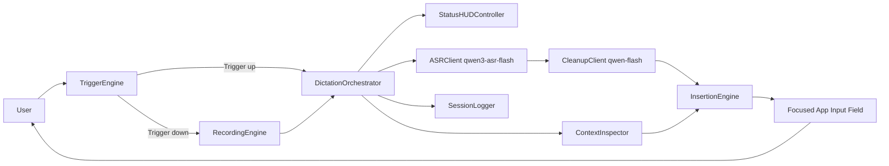
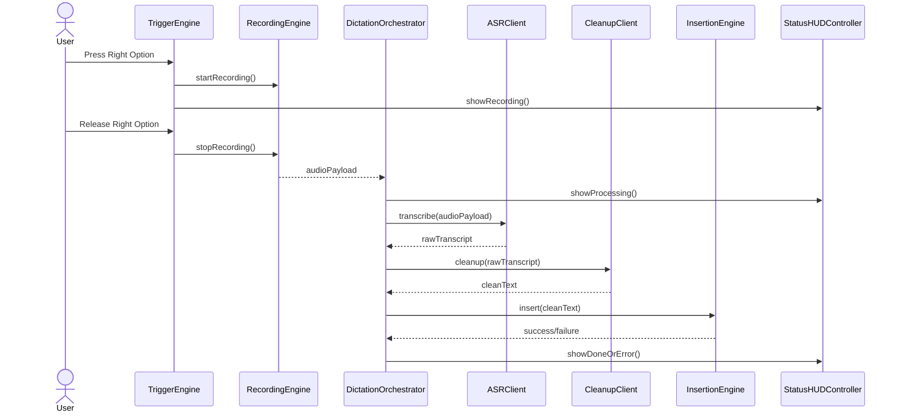
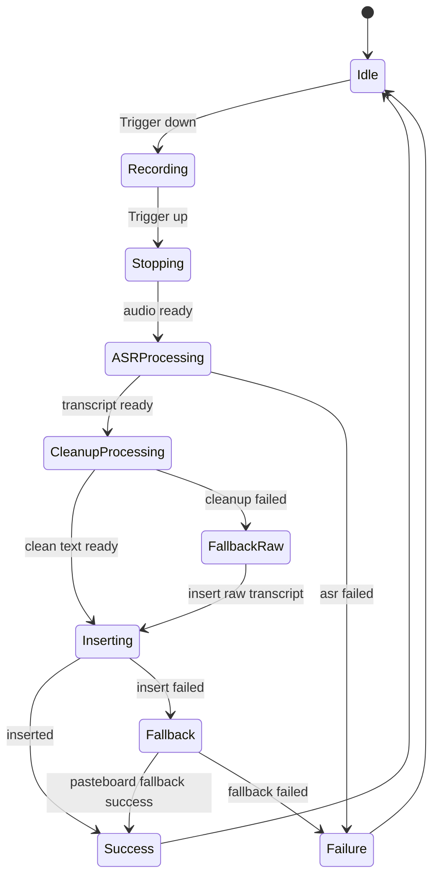
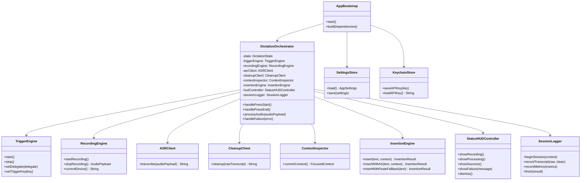

# voiceKey V1 系统设计

最后更新：2026-04-11

> 注意：这份文档保留的是早期系统设计草案，里面仍有 `Right Option` 等历史触发方案。当前权威版本请优先看：
> - [内部详细设计图](./internal-design.md)
> - [类图](./class-diagram.md)

## 1. 设计目标

做一个足够像 竞品 的极简输入工具。

用户感知必须是：

`按住触发键说话，松开后，一段干净文本直接落到当前输入框。`

当前开发期默认触发键：

`Right Option`

未来目标触发键：

`Fn`

## 2. 非目标

这一版明确不做：

- 说话时实时 partial
- 语音问答
- 选中文本改写
- 翻译模式
- 历史面板
- 云端账号系统

## 3. 总体架构图



## 4. 运行时序图



## 5. 状态机



## 6. 模块说明

### 6.1 `DictationOrchestrator`

系统核心协调器。

它不直接处理底层录音和 UI 细节，只负责：

- 驱动状态机
- 串起录音、ASR、clean-up、插入
- 控制失败回退

### 6.2 `TriggerEngine`

职责：

- 统一捕获触发键 `down` 和 `up`
- 向 orchestrator 发出开始和结束事件

设计要求：

- 与 UI 解耦
- 开发期默认 `Right Option`
- 后续可切换到 `Fn`
- 可替换为别的 trigger key 做调试

### 6.3 `RecordingEngine`

职责：

- 管理 `AVAudioEngine`
- 输出短音频 payload
- 控制临时文件生命周期

设计要求：

- 不依赖阿里 SDK
- 只暴露通用音频结果

### 6.4 `ASRClient`

职责：

- 把音频提交到 `qwen3-asr-flash`
- 返回 transcript

设计要求：

- 只做网络请求和结果解析
- 不混入 prompt 逻辑

### 6.5 `CleanupClient`

职责：

- 调用 `qwen-flash`
- 将 transcript 变成最终插入文本

设计要求：

- 默认只输出结果文本
- 丢弃 reasoning 内容

### 6.6 `ContextInspector`

职责：

- 获取当前 frontmost app
- 获取 focused element
- 判断当前输入位置是否可编辑

### 6.7 `InsertionEngine`

职责：

- 优先使用 AX 直接写入
- 失败时切换剪贴板回退

### 6.8 `StatusHUDController`

职责：

- 提供轻量状态反馈
- 不打断当前输入流

### 6.9 `SessionLogger`

职责：

- 记录每次输入链路的耗时和结果
- 支持定位卡顿和失败原因

## 7. 类图



## 8. 关键对象

### 8.1 `AudioPayload`

```text
format
sampleRate
channels
data
durationMs
```

### 8.2 `FocusedContext`

```text
bundleIdentifier
applicationName
elementRole
isEditable
windowTitle
```

### 8.3 `InsertionResult`

```text
success
usedFallback
failureReason
```

### 8.4 `LatencyMetrics`

```text
recordingDurationMs
asrDurationMs
cleanupDurationMs
insertionDurationMs
totalAfterReleaseMs
```

## 9. Clean-up 规范

### 9.1 Prompt 目标

- 清理口头禅
- 删除重复
- 轻度整理句子
- 补基本标点
- 保留原意

### 9.2 Prompt 禁止项

- 不补充信息
- 不扩写
- 不总结
- 不转换成公告或文章口吻
- 不输出解释

### 9.3 输出要求

- 只输出最终文本
- 不输出 reasoning
- 不输出前缀和说明

## 10. 交互设计原则

### 10.1 无确认流

用户不应该在松开后再点确认。

### 10.2 小反馈，不抢焦点

HUD 必须轻。

它的作用是让用户知道系统在工作，不是把用户从当前 app 拉走。

### 10.3 文本永不白说

不管哪里失败，最终都要给用户一条可复制结果。

## 11. 兼容性测试目标

第一阶段只测这 3 个：

- Apple Notes
- Slack
- Chrome 文本框

理由：

- 一个原生 app
- 一个 Electron app
- 一个浏览器文本框

这 3 个一旦打通，大多数问题就会暴露出来。

## 12. 下一阶段实现顺序

1. `Right Option` 捕获 spike
2. AX 文本插入 spike
3. 终端版 ASR + clean-up harness
4. menubar 宿主
5. 端到端闭环
6. HUD 和 fallback

## 13. 结论

这版设计的重点不是堆能力，而是把一条路径做到可靠：

`Fn -> 语音 -> 干净文本 -> 当前输入框`
`Right Option -> 语音 -> 干净文本 -> 当前输入框`

只要这条路径像 竞品，一期就成立了。
